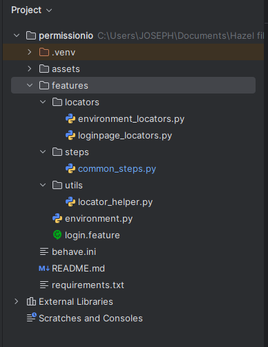

# Permission io Automation test Exam by Hazel Yu
Automated testing of the Permission.io website, particularly on the login screen for reCAPTCHA handling. I chose Option 1: Manual Intervention of script because the reCAPTCHA verification process involves user-specific interaction, which cannot be fully automated without violating Google's terms of service 


# Playwright Python Project with Behave (BDD)

This project is written using **Python Playwright** for browser automation, and it employs **Behave** for **Behavior-Driven Development (BDD)**. The project allows you to write browser-based tests using natural language Gherkin syntax and run them using Playwright for automated testing.

## Features

- **Python Playwright**: Used for browser automation.
- **Behave**: A BDD framework for writing and running automated acceptance tests.
- **Gherkin syntax**: Write tests in a human-readable format.

## Prerequisites

Before running the tests, you need to have the following installed:

- **Python 3.x**: This project is compatible with Python 3.7 and above.
- **pip**: Python's package installer.

## Installation

Follow these steps to set up the project locally:

### 1. Clone the repository

First, download or clone this repository to your local machine 

### 2. Set up a virtual environment (Optional but recommended)
It's recommended to create a virtual environment to keep your dependencies isolated.

```bash
python -m venv venv
```
- On Windows
  ```bash
   .\venv\Scripts\activate
  ```

- On macOS/Linux
  ```bash
   source venv/bin/activate
  ```
### 3.  Install dependencies
After activating your virtual environment, install the required Python packages by running:
```bash
pip install -r requirements.txt
```
This will install the following dependencies:
 - playwright: For browser automation.
 - behave: For writing and running BDD-style tests.
 - Other dependencies required for the project.

## Project Structure
This project follows Behavior-Driven Development (BDD) principles and is organized into the following main folders:
 - **Features:** Contains .feature files where we define the application's behavior in plain English using Gherkin syntax. only one feature file is written for this project "login.feature"


- **Locators:** Stores all CSS locators used to find elements on the web pages during the tests. Keeping them in one place makes the code easier to maintain.

- **Steps:** Contains step definitions for the BDD scenarios in the .feature files. These are the actions that the tests will perform

- **Utils:** I have added utility files with helper functions, such as methods for working with locators

**The Project Structure**


## Run the test

## Run all test in the feature folder
To run the BDD tests written in Gherkin syntax with Behave, Open Your Terminal(mac/OS) or CMD(windows), also you can run the project in your chosen IDE. Go to the project directory root *e.g "C:\<directory_name>\permissionio>"* and use the following command:
```bash
behave
```
This will execute all the tests in the features folder.

## Generate HTML Reports
To generate an HTML report for your test run, use this command: html file will be generated in the project directory name
```bash
behave -f html-pretty -o behave-report.html
```

